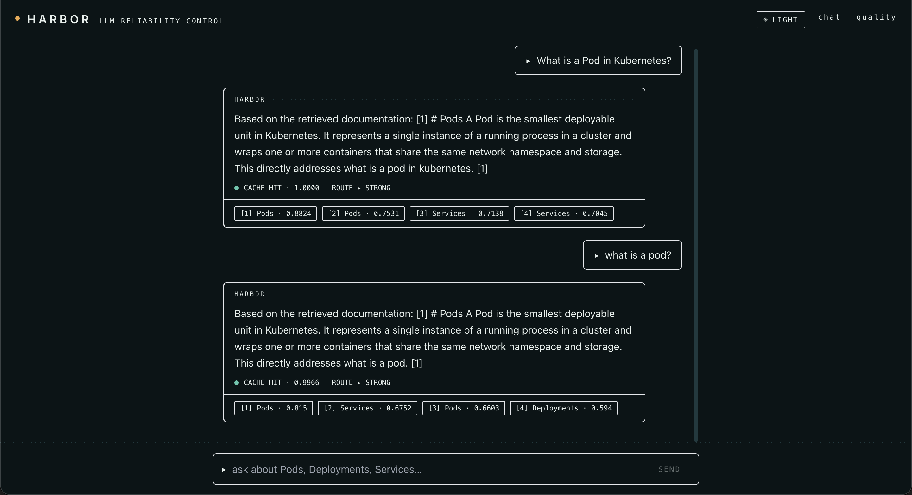
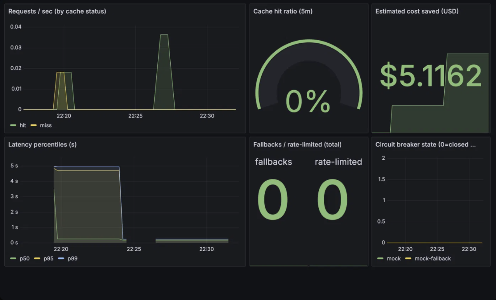

# Harbor

**A self-hosted reliability layer for LLM applications.** Harbor sits between
your app and your model provider and makes LLM traffic cheaper, faster,
observable, and safe to change — combining an OpenAI-compatible gateway,
streaming semantic cache, model routing, provider fallback with circuit
breaking, rate limiting, an evaluation control plane with a CI regression gate,
and end-to-end observability in one system you run yourself.

> Not affiliated with the CNCF "Harbor" container registry.

The whole stack runs offline against a **deterministic mock provider** — no API
keys, no network egress — so you can clone it and see every feature work in one
`make up`. Point it at any OpenAI-compatible endpoint (OpenAI, Ollama, vLLM) for
a real model. A small **reference RAG app** (Q&A over a Kubernetes docs corpus)
ships alongside purely to generate realistic traffic; the engineering substance
is the reliability layer.

---

## Screenshots

| Chat + live telemetry | System dashboard (Grafana) |
|---|---|
|  |  |

Each answer surfaces its own telemetry — cache **hit/miss** with cosine
similarity, the **route** tier, and the serving **provider** — read straight
from the gateway's `X-Harbor-*` response headers.

---

## What it does

- **OpenAI-compatible gateway (Go).** Drop-in `/v1/chat/completions` with SSE
  streaming; your existing client code doesn't change.
- **Streaming semantic cache.** Cosine similarity over query embeddings, keyed by
  model + context + prompt version, with Redis write-through for warm restarts.
  A hit replays as a synthetic token stream — same client contract, near-zero
  latency.
- **Model routing.** Deterministic rule-based routing to a cheap or strong model
  by prompt shape (kept deterministic so the cache stays coherent).
- **Provider fallback + circuit breaker.** An ordered provider chain, each behind
  its own breaker; failover happens before the first token, a dead provider's
  circuit opens to stop the bleeding, and a graceful degraded response is served
  (never cached) if everything is down.
- **Rate limiting.** Atomic token bucket in Redis via a Lua script, fail-open.
- **Evaluation control plane (Python/FastAPI).** A golden dataset, tiered
  evaluators, and a **statistical regression gate** wired into GitHub Actions.
- **Observability.** Real Prometheus metrics on the gateway, a provisioned
  Grafana dashboard for the system view, and a React "Quality" dashboard for the
  eval view.

---

## Headline results

Measured on a cold cache against the mock provider (Zipf-skewed workload,
`s=1.2`, 400 requests, concurrency 16). Full methodology and honest caveats in
**[`docs/BENCHMARKS.md`](docs/BENCHMARKS.md)**.

| What | Result | Qualifier |
|---|---|---|
| Cache hit rate | **85%** | On skewed traffic over a 12-topic catalog; skew-dependent |
| Latency on hits | **~9.5× faster** (p50 ≈120 ms vs ≈1155 ms) | Hit path real; miss latency is a simulated model |
| Estimated spend avoided | **~85%** | Two independent cost models agree on the % |
| Requests served during a total primary outage | **400/400** | Cache + fallback; breaker opened; zero user-facing errors |
| Regression gate | **fails bad changes, passes noise** | MWU + Cliff's δ + Holm; verified both directions |

*These numbers are honest about their limits — the mock provider's miss latency
is simulated, and the hit rate is a ceiling for this workload. See the
benchmarks doc before quoting them.*

---

## Architecture

```
                       React UI (chat + quality)
                                │
                                ▼
                     FastAPI reference app ───────── pgvector retrieval
                                │                     (Kubernetes corpus)
                                ▼
   ┌──────────────────── Harbor Gateway (Go) ────────────────────┐
   │  rate limit → route → semantic cache → dispatch chain        │
   │                                          │                   │
   │                                    provider + breaker        │
   │                                    provider + breaker ...     │
   │  Prometheus /metrics                                          │
   └───────────────────────────────┬──────────────────────────────┘
                                    ▼
                          LLM provider (mock | OpenAI | Ollama | vLLM)

   Control plane (Python):  golden eval suite → regression gate → GitHub Actions
   Observability:           Prometheus ──scrape──▶ Grafana dashboard
```

- **Data plane** — the Go gateway: OpenAI-compatible proxy, semantic cache with
  streaming replay, Redis+Lua rate limiting, routing, fallback, circuit
  breaking, Prometheus metrics.
- **Control plane** — Python/FastAPI: eval suites over a golden dataset,
  Mann-Whitney U regression detection, a GitHub Actions gate, and read-only APIs
  feeding the React quality dashboard.

Full design rationale in **[`docs/DESIGN.md`](docs/DESIGN.md)**.

---

## Quickstart

Requirements: Docker + Docker Compose, and Node 18+ (for the frontend).

```bash
make up          # postgres, redis, gateway, refapp, prometheus, grafana
make ingest      # embed the starter Kubernetes corpus into pgvector
make fe          # React UI on http://localhost:5173
```

Ask *"What is a Pod in Kubernetes?"*, then ask a paraphrase — watch the second
answer come back as a **cache hit** with its similarity score.

### See the reliability layer do its job

```bash
make reset-cache     # cold cache for a clean measurement
make bench           # Zipf workload -> hit rate, latency percentiles, cost saved
make grafana         # print Grafana / Prometheus URLs
make eval-seed       # seed the golden dataset (first run only)
make eval-gate       # eval suite + regression gate vs committed baseline -> PASSES
make eval-gate-bad   # same, with a context-dropping prompt -> FAILS (exit 1)
```

That non-zero exit on `eval-gate-bad` is the point: it's what turns a red check
on a pull request and blocks a quality regression from merging.

### Use a real model

Edit `.env`:

```env
PROVIDER=openai
OPENAI_BASE_URL=https://api.openai.com/v1   # or http://host.docker.internal:11434/v1 for Ollama
OPENAI_API_KEY=sk-...
PRIMARY_MODEL=gpt-4o-mini
```

Then `make up` again. The cache, routing, fallback, and eval logic are unchanged;
latency and cost simply become real.

---

## Services & ports

| Service    | Port | Purpose                                          |
|------------|------|--------------------------------------------------|
| refapp     | 8000 | FastAPI reference app + control-plane API        |
| gateway    | 8080 | Go data-plane gateway (OpenAI-compatible) + `/metrics` |
| postgres   | 5432 | pgvector store                                   |
| redis      | 6379 | semantic cache backing + rate-limit buckets      |
| prometheus | 9090 | scrapes the gateway's metrics                    |
| grafana    | 3000 | provisioned system dashboard (anonymous access)  |
| frontend   | 5173 | React chat + quality UI (host dev server)        |

---

## Evaluation & CI

The regression gate compares a candidate run to a committed baseline
(`eval/baseline.json`) per evaluator using a **Mann-Whitney U** test, gated on a
**Cliff's delta** effect size and corrected across evaluators with
**Holm-Bonferroni**. A regression requires significance *and* a meaningful effect
*and* a negative mean delta, so noise doesn't trip it and a real quality drop
can't slip through. The gate runs in
[`.github/workflows/eval.yml`](.github/workflows/eval.yml) on every PR and exits
non-zero on regression.

---

## Limitations & future work

Called out honestly (details in [`docs/BENCHMARKS.md`](docs/BENCHMARKS.md)):

- **Single-node cache.** In-process with Redis write-through; not yet a shared
  cache across gateway replicas. Next: a shared vector store or namespace
  sharding.
- **No request coalescing.** Concurrent duplicate misses aren't single-flighted,
  so cold-start bursts under-count the achievable hit rate.
- **Mock-provider benchmarks.** Miss latency is simulated; the hit path and all
  mechanics are real. Numbers with a real backend will differ.
- **Schema via `create_all`.** Alembic migrations are deferred to polish.

---

## Repo layout

```
gateway/            Go 1.24 data-plane gateway (cache, routing, fallback, breaker, metrics)
refapp/             FastAPI reference RAG app + ingestion + eval control plane + bench
frontend/           React + TS + Tailwind (chat + quality dashboard, light/dark)
observability/      Prometheus config + Grafana provisioning & dashboard
eval/               committed baseline snapshot for the CI gate
.github/workflows/  eval regression gate (CI)
docs/               DESIGN.md · BENCHMARKS.md · DEMO.md · images/
```

## License

MIT © Sohan Reddy
